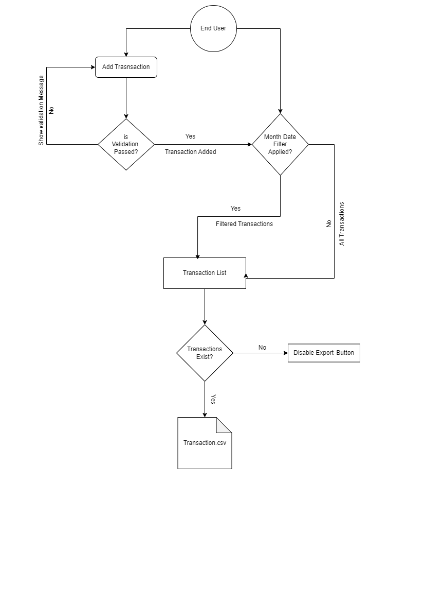

# Wallet Manager

## Overview

This project is a transaction management system that allows users to add transactions, filter them by month and date, and calculate totals for income and expenditures. The application is built using React, making it efficient and user-friendly.

## Solution Explanation

### Thought Process

When I began working on the transaction management system, my first step was to clearly define the key features needed: adding transactions, filtering them by date, and calculating totals for income and expenditures. Here’s how I approached it:

1. **Understanding Requirements**: I focused on gathering all necessary features to ensure the application would meet user needs effectively.
2. **Component Design**: I mapped out the UI components, emphasizing reusability. This led to creating a dedicated dialog for adding transactions and a separate components for displaying the transaction list, filter and export transactions
3. **State Management**: I opted for React’s state hooks to manage the form data and transaction states efficiently.
4. **Filtering Logic**: I implemented a filtering system to let users filter transactions by year and month, aiming for a seamless user experience.
5. **Calculating Totals**: I integrated functionality to calculate total income and expenditures based on the filtered transactions.

### Technology Choices

I chose **React** for a few key reasons:

- **Component-Based Structure**: React’s approach allows for a modular design, making it easy to manage and maintain individual UI pieces.
- **Efficient State Management**: The state hooks in React make handling user interactions straightforward.
- **Performance Benefits**: React’s virtual DOM ensures efficient updates to the UI, which is especially useful when dealing with lists of transactions.

### Design Decisions

#### Architecture

The application architecture includes a main component that manages transaction data, along with child components for the add transaction form, transactions list, filter and export feature. This separation helps keep things organized and makes the code more readable.

#### Design Patterns

- **Container/Presentational Pattern**: I implemented a clear distinction between components that manage data and those that focus solely on displaying it. This separation simplifies logic and enhances reusability.
- **Using Hooks**: React hooks like `useState`, `useEffect` and `useCallback` were utilized to manage state and optimize function performance, resulting in cleaner code.

### Requirement Fulfillment

The solution meets the outlined requirements effectively:

- Users can easily add transactions with all necessary validations in place.
- The filtering capabilities allow for quick searches based on year and month.
- The application accurately calculates and displays totals for both income and expenditures.

#### Challenges

A challenge I faced was ensuring that the date inputs were formatted correctly. To address this, I used regex validation to enforce the `YYYY/MM/DD` format and created a utility function for date validation, which streamlined user input.

### Future Work

There are several areas where I could enhance the application further:

- **Improved Filtering Options**: Adding more filter capabilities, like transaction type or amount range.
- **Data Persistence**: Integrating local storage or a backend API to save transactions permanently.
- **UI Enhancements**: Upgrading the UI with better styling and potential animations for smoother interactions.
- **Testing**: Incorporating unit tests to ensure all functionalities work correctly and maintain code quality.

## Project Diagram

Here’s an overview of the system architecture:

## Getting Started

1. Clone the repository.
2. Install dependencies using `npm install`.
3. Start the development server with `npm start`.
